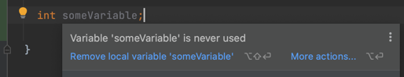

# Annotations

Java **Annotation** is a tag that represents the _metadata_ i.e. attached with class, interface, methods or fields to indicate some additional information which can be used by java compiler and JVM.

An example of Annotations:



```java
@SuppressWarnings("unused")
int someVariable;
```

## Custom annotation

```java
@interface MyAnnotation { }
```

## Types of Annotation

1. Marker Annotation
2. Single-Value Annotation
3. Multi-Value Annotation

### Marker Annotation

An annotation that has no method, is called a marker annotation:

```java
@interface MyAnnotation { }
```

The `@Override` and `@Deprecated` are marker annotations.

### Single-Value Annotation

An annotation that has one method, is called a single-value annotation:

```java
@interface MyAnnotation {
  int value();
}
```

We can provide the default value also:

```java
@interface MyAnnotation {
  int value() default 0;
}
```

How to apply Single-Value Annotation:

```java
@MyAnnotation(value = 10)
```

### Multi-Value Annotation

An annotation that has more than one method, is called Multi-Value annotation:

```java
@interface MyAnnotation {
  int value1();
  String value2();
  String value3();
}
```

We can provide the default value also:

```java
@interface MyAnnotation {
  int value1() default 1;
  String value2() default "";
  String value3() default "xyz";
}
```

How to apply Multi-Value Annotation:

```java
@MyAnnotation(value1 = 10, value2 = "some value", value3 = "some other value")
```

## Built-in Annotations used in custom annotations in java

1. `@Target`
2. `@Retention`
3. `@Inherited`
4. `@Documented`

### `@Target`

`@Target` is used to specify on which type, the annotation can be used.

The `java.lang.annotation.ElementType` enum declares many constants to specify the type of element where annotation is to be applied such as `TYPE`, `METHOD`, `FIELD` etc.

| Element Type    | Where the annotation can be applied |
|-----------------|-------------------------------------|
| TYPE            | class, interface or enum            |
| FIELD           | fields                              |
| METHOD          | methods                             |
| CONSTRUCTOR     | constructors                        |
| LOCAL_VARIABLE  | local variables                     |
| ANNOTATION_TYPE | annotation type                     |
| PARAMETER       | parameter                           |

Example to specify annotation for a class:

```java
@Target(ElementType.TYPE)
@interface MyAnnotation {
  int value1();
  String value2();
}
```

Example to specify annotation for a class, methods or fields:

```java
@Target({ElementType.TYPE, ElementType.FIELD, ElementType.METHOD})
@interface MyAnnotation {
  int value1();
  String value2();
}
```

### `@Retention`

`@Retention` is used to specify to what level annotation will be available.

| Retention Policy        | Availability                                                                                              |
|-------------------------|-----------------------------------------------------------------------------------------------------------|
| RetentionPolicy.SOURCE  | refers to the source code, discarded during compilation. It will not be available in the compiled class.  |
| RetentionPolicy.CLASS   | refers to the `.class` file, available to java compiler but not to JVM. It is included in the class file. |
| RetentionPolicy.RUNTIME | refers to the runtime, available to java compiler and JVM.                                                |

```java
@Retention(RetentionPolicy.RUNTIME)
@Target(ElementType.TYPE)
@interface MyAnnotation {
  int value1();
  String value2();
}
```

## `@Inherited`

By default, annotations are not inherited to subclasses. The `@Inherited` annotation marks the annotation to be inherited to subclasses.

```java

@Inherited
@interface ForEveryone {
} //Now it will be available to subclass also

@interface ForEveryone { }

class Superclass { }

class Subclass extends Superclass { }
```

### `@Documented`

`@Documented` marks the annotation for inclusion in the documentation.